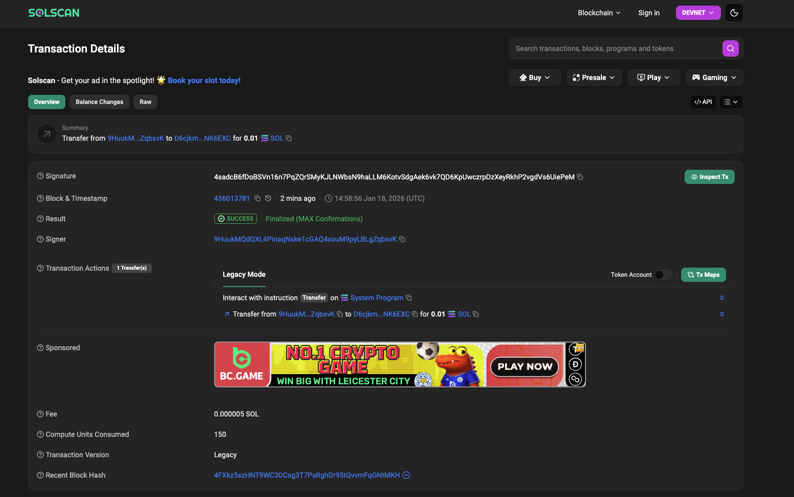
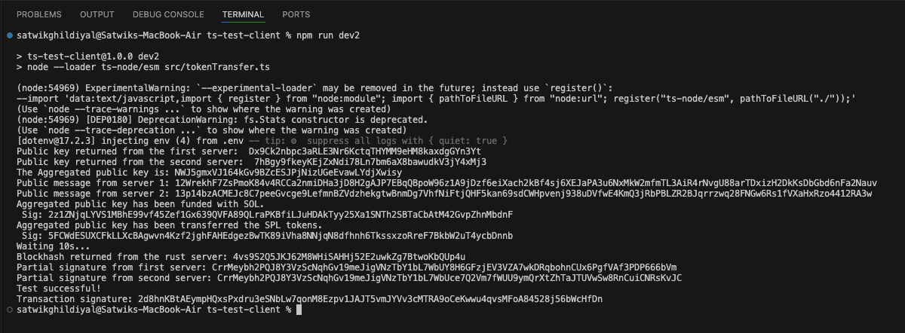
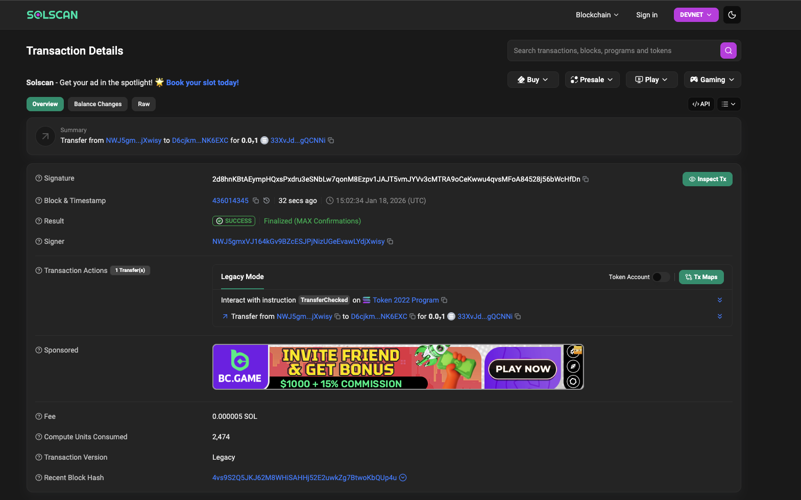
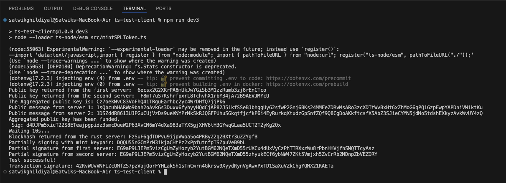
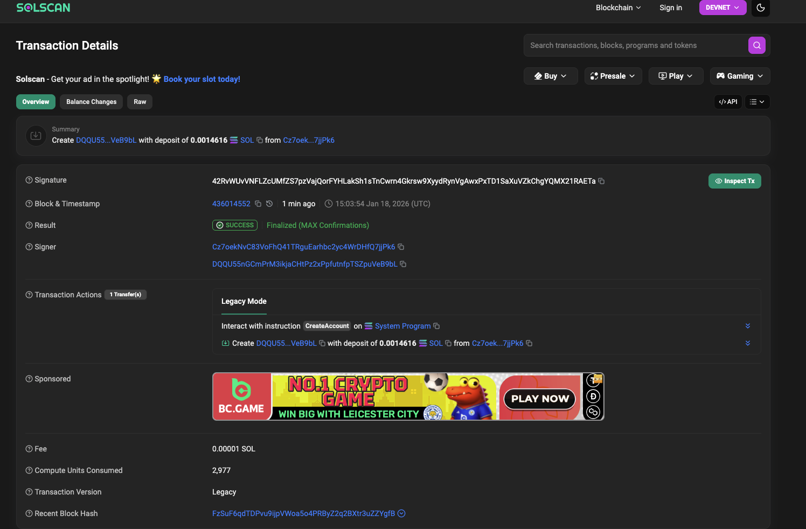
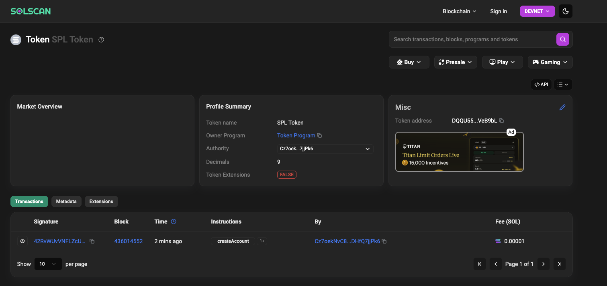

# TSS Solana Signing Demo (2 Rust servers + TS client)

This repo is a minimal end-to-end demo of a **2-party threshold signing (TSS)** setup used to sign Solana transactions with an **aggregated public key**.

It runs:
- **Two Rust servers** (Server 1 + Server 2) that each hold a TSS share and return **partial signatures**
- **One TypeScript test client** that builds Solana transactions, collects partial signatures from both servers, and asks one server to **finalize** the transaction (aggregate partial sigs into a valid Ed25519 signature) and broadcast.

---

## Architecture (high level)

- Each Rust server creates/loads a TSS key share for a given `external_user_id`.
- The client requests both servers to participate in a signing session:
  1. Client asks both servers for their per-session **step one** public message.
  2. Client builds a Solana transaction and serializes it (base64).
  3. Client sends the tx + the *other server’s* step-one message to each server to produce **partial signatures**.
  4. Client sends both partial signatures to **Server 1** to finalize:
     - verify aggregated signature against the aggregated pubkey + tx message
     - insert the aggregated signature into the correct Solana signature slot
     - submit the tx to Solana

---

## Repo structure

Typical layout:

- `rust-backend-1/` → Server 1 (finalizer) at `http://127.0.0.1:3000`
- `rust-backend-2/` → Server 2 at `http://127.0.0.1:3001`
- `ts-test-client/` → TypeScript test client scripts
- `assets/` → screenshots used in this README

---

## Rust servers

You run two backends:

- **Server 1**: `http://127.0.0.1:3000`
- **Server 2**: `http://127.0.0.1:3001`

They expose the same logical API (two-party signing), with Server 1 also acting as the **finalizer**.

### Endpoints (conceptual)

- `POST /generate`
  - Creates/loads a participant key share for an `external_user_id`
  - Returns that server’s public key

- `POST /aggregate_keys`
  - Takes both servers’ public keys and returns the **aggregated public key**
  - This aggregated pubkey becomes the on-chain “wallet address” for the TSS wallet

- `POST /step_one`
  - Starts a signing session for `external_user_id`
  - Returns a **public message** needed by the other party to produce a partial signature

- `POST /step_two` (or `POST /step_two_`)
  - Input: `tx` (base64), both signer keys, and the *other server’s* step-one message
  - Output: a **partial signature**

- `POST /finalize`
  - Input: `tx` (base64), both partial signatures, and both signer keys
  - Output: the final Solana transaction signature (and broadcasts it)

---

## TypeScript client scripts

There are 3 demo flows:

### 1) Simple SOL transfer
- Funds the aggregated pubkey wallet (optional)
- Builds a `SystemProgram.transfer` transaction
- TSS signs and sends the transfer

### 2) SPL / Token-2022 transfer
- (Optional) creates recipient ATA (idempotent)
- Uses `createTransferCheckedInstruction`
- TSS signs with aggregated pubkey as fee payer / signer
- Sends the transfer

### 3) Mint creation transaction
- Creates a new mint account via `SystemProgram.createAccount`
- Initializes mint via `createInitializeMint2Instruction`
- Requires **mint keypair signature** + **fee payer signature**
- Fee payer is set to aggregated pubkey, so TSS must sign the fee payer slot
- Client **partial signs** with the mint keypair locally, then TSS signs + finalizes

---

## Setup

### Requirements
- Rust toolchain (`cargo`)
- Node.js + npm
- A Solana RPC URL (Devnet recommended)

### Environment variables

In `ts-test-client/.env` (example):

- `DEVNET_RPC_URL=...`

---

## Run the demo

### 1) Start Rust servers (two terminals)

**Terminal A**
```sh
cd rust-backend-1
cargo run
```

**Terminal B**
```sh
cd rust-backend-2
cargo run
```

You should see logs like:

TSS Rust backend 1 running at http://127.0.0.1:3000

TSS Rust backend 2 running at http://127.0.0.1:3001

### 2) Run TS client scripts


```sh
cd ts-test-client
npm install
```


```sh
npm run dev1   # SOL transfer demo
npm run dev2   # SPL/Token-2022 transfer demo
npm run dev3   # Mint creation demo
```


## SOL transfer
 

## SPL / Token-2022 transfer
 

## Mint creation
  


